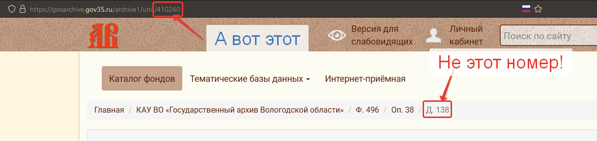
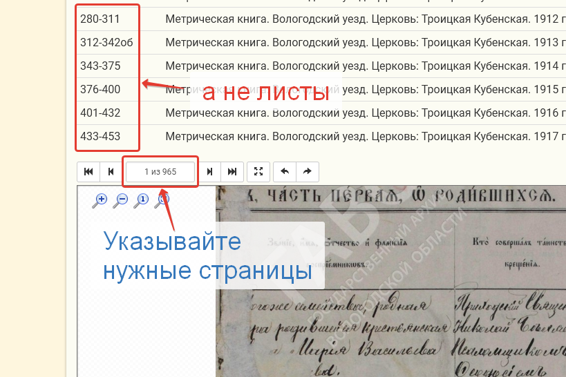

Скрипт позволяет массово скачать архивные документы из каталога фондов сайта [Государственного архива Вологодской области](https://gosarchive.gov35.ru/archive).

## Как пользоваться?
Утилита для командной строки.
Для работы скрипта необходимо, чтобы в системе был устновлен интерпретатор Python.

## Установка
```
git clone https://github.com/qzya/vol-archive-grabber.git
```

## Как пользоваться?
1. Запустите скрипт из директории vol-archive-grabber: файлы архива будут сохранятся именно в ту директорию, из которой был запущен скрипт.
```
cd vol-archive-grabber
python archive-grabber.py
```

2. На запрос "Введите номер дела:" введите **идентификационный** номер архивного дела. Его можно найти в строке адреса на сайте:



номер состоит не более, чем из 6 цифр.

3. Введите номер начальной страницы, с которой необходимо начать сохранение. Листы в описании чаще всего **не соответствуют** страницам (отдельным файлам), ориентируйтесь на счетчик страниц в окне просмотра дела:



4. Введите номер конечной страницы.
5. После завершения работы программы в каталоге, из которого был запущен скрипт, будет создана папка с именем - идентификационным номером, в ней - файлы jpeg со страницами.

Файл desc.html в этой же папке содержит описание дела.

## А можно проще?
Можно. В релизах скачайте исполняемый файл archive-grabber.exe для Windows.

Переместите файл в отдельную папку.

Запустите, следуйте инструкциям с пункта 2.

:exclamation:На exe файл могут ругаться антивирусы т.к. скрипт осуществляет запросы на внешний ресурс. Временно отключите антивирус, либо добавьте папку с программой в исключения антивируса.:exclamation:
